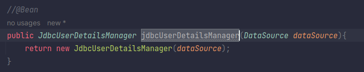
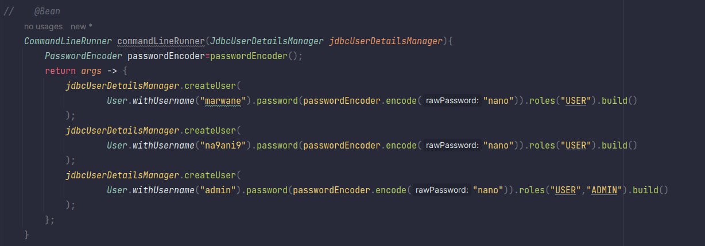
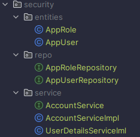
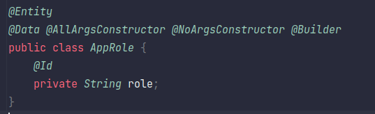
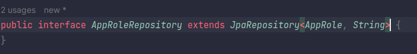
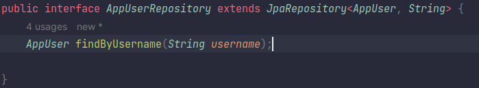
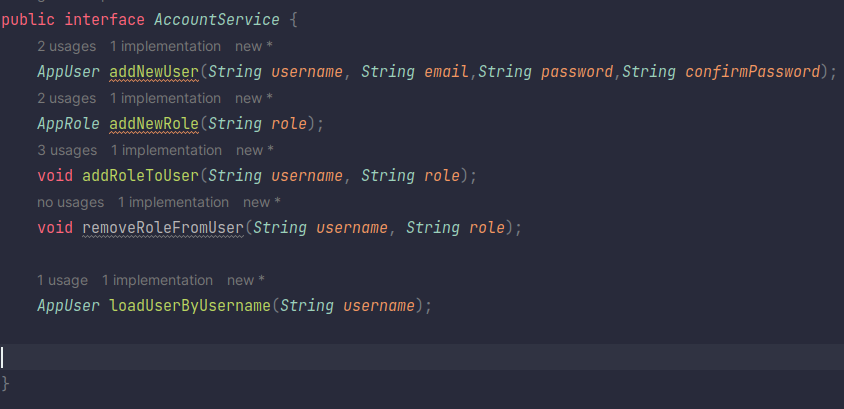
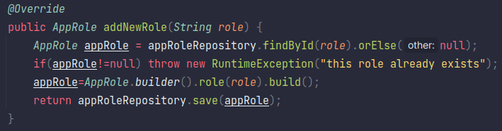

# Spring Security

---

# In Memory User Authentication:

# Jdbc User Details Manager

# User Details Service

## Entities

---

### AppRole Entity

### AppUser Entity

## Repositories

---

### AppRole Repository

### AppUser Repository

## Services

---

### AccountService Interface

### AccountService Implementation Class

### User Details Service Implementation

