# Spring Security

---

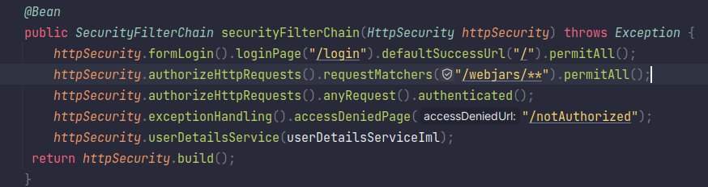

# In Memory User Authentication:

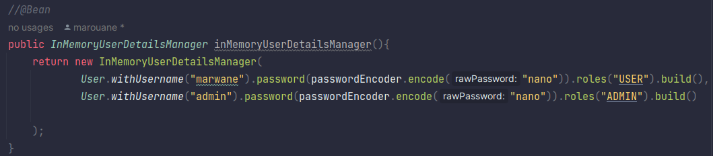

# Jdbc User Details Manager

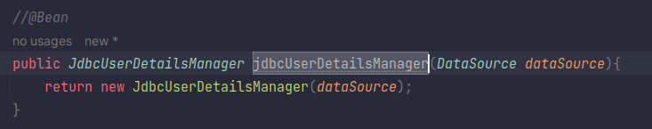

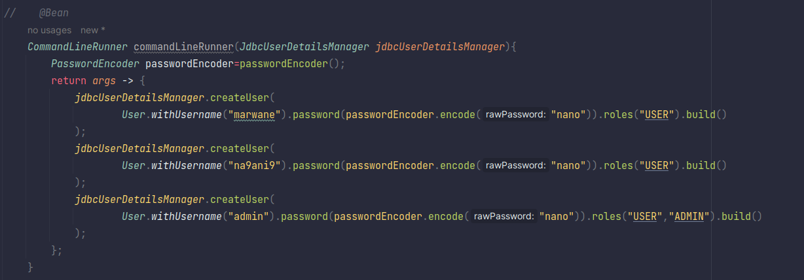

# User Details Service

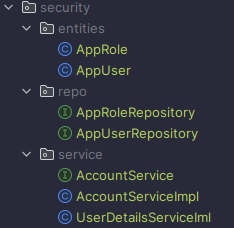
## Entities

---

### AppRole Entity

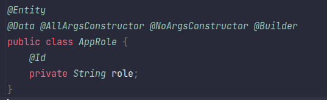

### AppUser Entity

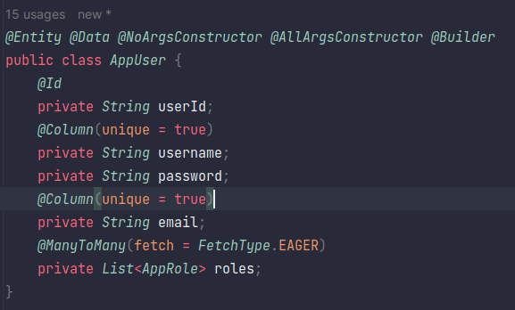

## Repositories

---

### AppRole Repository

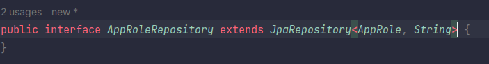

### AppUser Repository

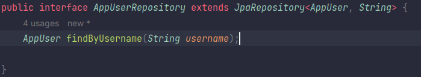

## Services

---

### AccountService Interface

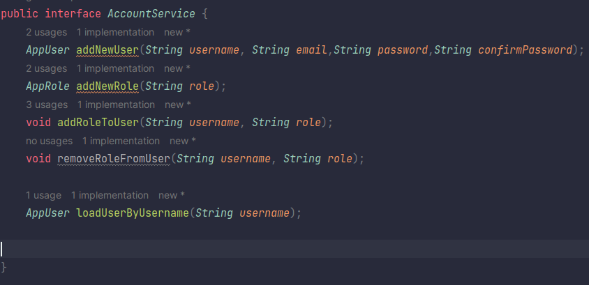

### AccountService Implementation Class

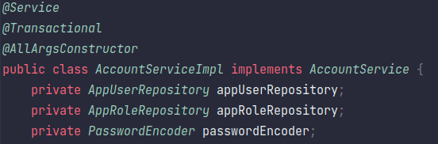

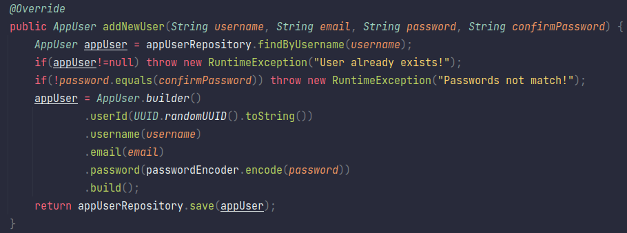

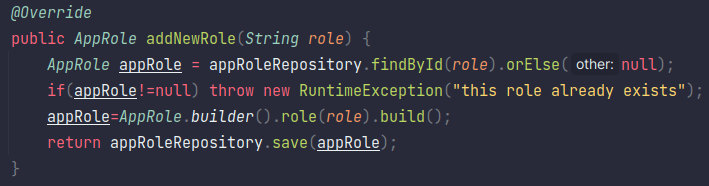

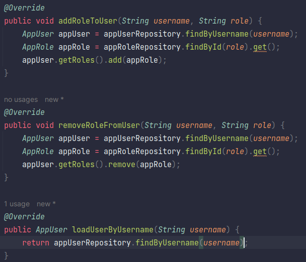

### User Details Service Implementation

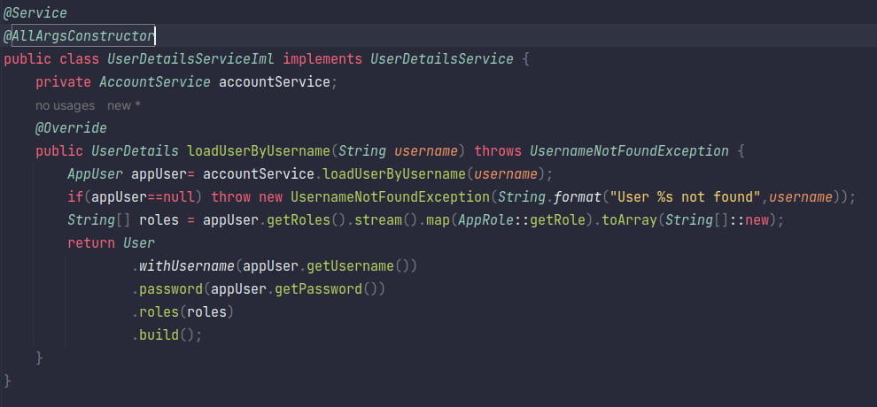

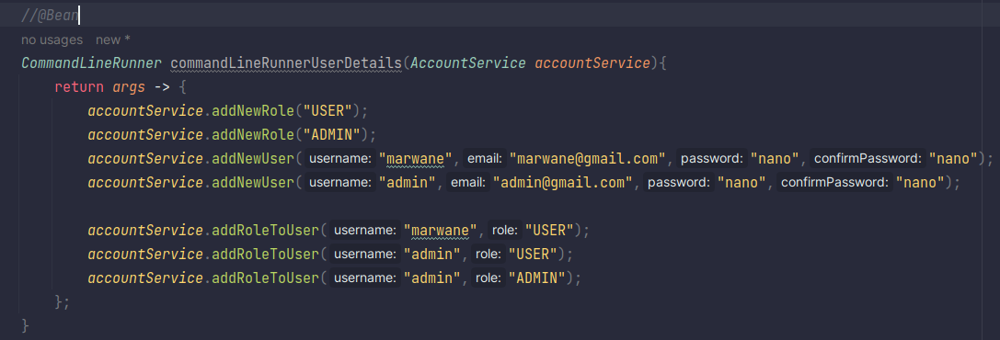

